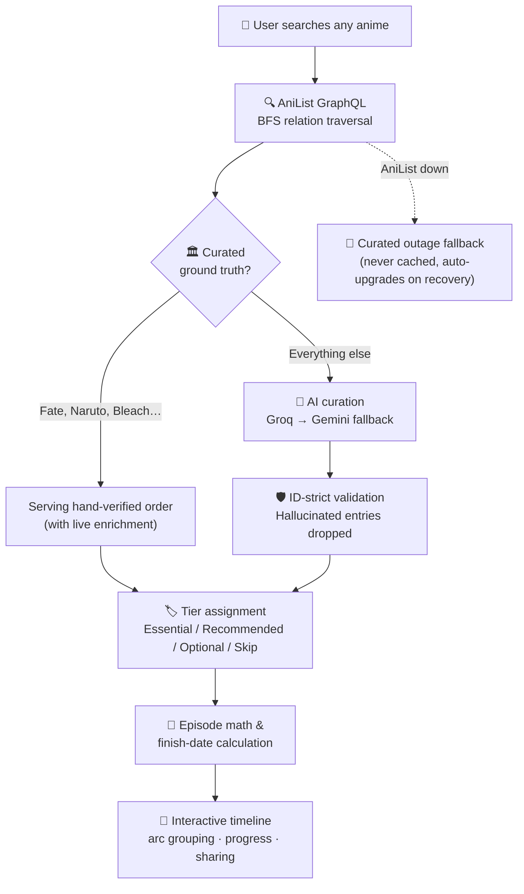

<div align="center">

# ⏳ MyAniWatchOrder

### Anime Journeys, Optimized.

**Any franchise. Any size. Zero spoilers.**

[](https://aniwatchorder.cc)
[](https://opensource.org/licenses/MIT)

An AI-powered watch order generator that maps **AniList's verified relation graph** into spoiler-safe, tiered timelines — with real finish-date math for your actual watching pace.

[Features](#-features) · [Architecture](#-how-it-works) · [Quick Start](#-quick-start) · [Tech Stack](#-tech-stack) · [Community](#-community)

</div>

---

## 🎯 The Problem

> *"I want to watch Fate, but there are 40+ entries across 5 timelines and every guide online disagrees."*

Every anime fan knows this moment. MyAniWatchOrder ends it — for **any** franchise, from this season's hits to 40-year-old multi-timeline universes, from mega-franchises to obscure OVAs nobody's written a guide for.

## ✨ Features

| Feature | What it does |
|---|---|
| 🧠 **Zero-Hallucination Engine** | Every entry in every order is grounded in a verified AniList ID. The AI orders and tiers — it can never invent a show. |
| 🗺️ **4-Tier Smart Skip** | Essential / Recommended / Optional / Skip, each with a plain-English reason. Filler arcs are marked; canon finales never are. |
| 🏛️ **Curated Ground Truth** | Hand-verified orders for the notoriously confusing — Fate, Re:Zero, JoJo, One Piece, Naruto, Bleach — with canon-movie placement and filler boundaries. |
| 📦 **Arc Maps** | 1000-episode long-runners (One Piece, Naruto, Dragon Ball, Gintama…) expand into saga-by-saga blocks with per-arc progress. |
| ⏱️ **Real Finish Dates** | Exact minutes, not rounded fluff — at Casual, Regular, Dedicated, or Binge pace. Or your own weekly schedule, exported to your calendar (.ics). |
| 🔍 **Discovery Library** | Curated shelves (Trending, Underrated Gems, Gateway, Hidden Classics), infinite filterable grid, and fatigue mutes — hide the genres you're tired of. |
| 🧬 **Personalized** | "Because you generated…" and "Off Your Usual Path" shelves — built from your history, no account required. |
| 📊 **Progress Tracking** | Episode-level progress in your browser, synced to your account if you make one. Finish dates update as you watch. |
| 🛡️ **Outage-Resilient** | Graceful degradation when AniList is down — truthful errors and curated fallbacks, never fake data. |

## 🔀 How It Works



**The guarantee:** the AI only ever *orders and tiers* entries that AniList's relation graph already verified. It cannot recommend a show that doesn't exist, and it cannot miscount episodes — counts come from the database, not the model.

## 🚀 Quick Start

```bash
git clone https://github.com/agenticweeb/chronoflow.git
cd chronoflow
npm install
```

Create `.env.local`:

```env
# AI providers (at least one)
GROQ_API_KEY=
GOOGLE_AI_API_KEY=

# Caching
UPSTASH_REDIS_REST_URL=
UPSTASH_REDIS_REST_TOKEN=

# Site
NEXT_PUBLIC_SITE_URL=http://localhost:3000
```

```bash
npm run dev
# → http://localhost:3000
```

<details>
<summary><b>🔑 Optional environment variables (auth, bots, feedback)</b></summary>

```env
# Supabase auth (email + Google + Discord OAuth)
NEXT_PUBLIC_SUPABASE_URL=
NEXT_PUBLIC_SUPABASE_PUBLISHABLE_KEY=
SUPABASE_SERVICE_ROLE_KEY=        # server-only — account deletion

# Discord bot
DISCORD_BOT_TOKEN=
DISCORD_APPLICATION_ID=
DISCORD_PUBLIC_KEY=
DISCORD_FEEDBACK_WEBHOOK=

# Cron
CRON_SECRET=
```

</details>

## 🛠️ Tech Stack

| Layer | Technology |
|---|---|
| Framework | **Next.js 16** (App Router, Turbopack) · React 19 · TypeScript |
| AI | Vercel AI SDK → Groq → Google Gemini (failover chain) |
| Data | AniList GraphQL API (relation graphs) · Jikan v4 (search) |
| State | Zustand · TanStack Query · nuqs |
| Cache | Upstash Redis (edge, per-namespace TTLs) |
| Styling | Tailwind CSS v4 · Framer Motion · Lucide |
| Auth | Supabase (optional accounts — the site works fully without one) |
| Hosting | Vercel |

## 🌍 Community

[](https://discord.gg/xXQYPUNum)
[](https://t.me/myanimewatchorder)
[](https://x.com/agenticweeb)

## 📄 License

MIT — see [LICENSE](LICENSE).

<div align="center">
<sub>Built by <a href="https://x.com/agenticweeb">@agenticweeb</a> · Watch anime right. 🍥</sub>
</div>
```

## Ship everything
